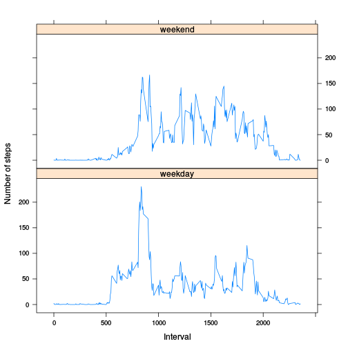

# Reproducible Research: Peer Assessment 1


## Loading and preprocessing the data


```r
##Load graphics library used later
library(lattice)
##Load data
data <- read.csv("activity.csv")
```

## What is mean total number of steps taken per day?


```r
##Calculate totals
sums <- aggregate(data$steps, list(data$date), FUN = sum, na.rm = T)
##Add column names
colnames(sums) <- c("Date", "Steps") 
##Calculate mean
mn <- mean(sums$Steps)
##Calculate median
md <- median(sums$Steps)
##Show histogram of total number of steps taken per day
with(sums, hist(Steps, ylim = c(1, 30)))
```

 

The mean total number of steps taken per day is 9354.2295 and the median is 10395.

## What is the average daily activity pattern?

```r
##Calculate averages
averages <- aggregate(data$steps, list(data$interval), FUN = "mean", na.rm = T)
##Add column names
colnames(averages) <- c("Interval", "Avg_Steps")
##Calculate highest average steps taken in any interval
maxsteps <- max(averages$Avg_Steps)
##Store interval with highest average steps
maxstepinterval <- averages[averages$Avg_Steps == maxsteps, 1]
##Show time series plot of interval and average steps
with(averages, plot(Interval, Avg_Steps, type = "l"))
```

 

The 835'th 5-minute interval, on average across all the days in the dataset, contains the maximum number of steps.

## Imputing missing values


```r
##Calculate count of NA records
nacount <- sum(is.na(data$steps))
##Create initial "complete" data set
completedata <- data
##Switch from integer to numeric to accomodate averages
completedata$steps <- as.numeric(completedata$steps)
##Populate missing data using interval averages
for(i in completedata[is.na(completedata$steps), 1]){
        completedata[is.na(completedata$steps), 1] <- averages[
                averages[, 1] == completedata[is.na(completedata$steps), 3], 2]
}
##Calculate totals
completesums <- aggregate(completedata$steps, list(completedata$date),
                          FUN = sum)
##Add column names
colnames(completesums) <- c("Date", "Steps")
##Calculate mean
completemn <- mean(completesums$Steps)
##Calculate median
completemd <- median(completesums$Steps)
##Calculate mean difference
completemndiff <- (completemn - mn)
##Calculate median difference
completemddiff <- (completemd - md)
##Calculate impact of imputing missing data on estimates of total daily steps
stepestdiff <- (sum(completedata$steps) - sum(data$steps, na.rm = T))
##Show historgram of total number of steps taken per day
with(completesums, hist(Steps, ylim = c(1, 40)))
```

 

The total number of missing values in the dataset is 2304.

The mean total number of steps taken each day is 1.0766 &times; 10<sup>4</sup> and the median is 1.0766 &times; 10<sup>4</sup>.
These values differ from the original values by 1411.9592 and 371.1887, respectively.
Imputing missing data increases the estimate of total daily steps by 8.613 &times; 10<sup>4</sup>.  Since we imputed using the interval mean, and there was a significant amount of missing data, that also caused the interval median to take on the same value as the interval mean.

## Are there differences in activity patterns between weekdays and weekends?


```r
##Add base factor data
completedata[, 4] <- "weekday"
##Populate Saturdays
completedata[weekdays(as.Date(completedata$date)) == "Saturday", 4] <- "weekend"
##Populate Sundays
completedata[weekdays(as.Date(completedata$date)) == "Sunday", 4] <- "weekend"
##Set to factor type
completedata[, 4] <- as.factor(completedata[, 4])
##Calculate averages
completeaverages <- aggregate(completedata$steps, list(
        completedata$interval, completedata[, 4]), FUN = "mean")
##Add column names
colnames(completeaverages) <- c("Interval", "DayType", "Avg_Steps")
##Show panel time series plot of internal and average steps, by day type
xyplot(Avg_Steps ~ Interval | DayType,
       data = completeaverages, layout = c(1, 2), type = "l",
       ylab = "Number of steps")
```

 
